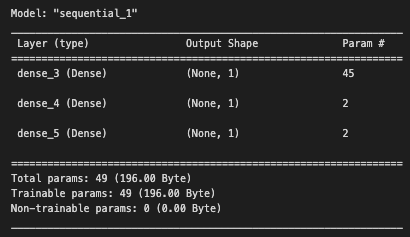
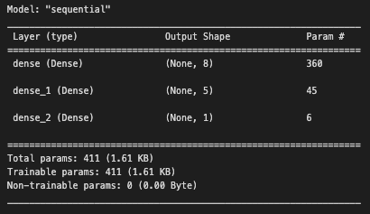
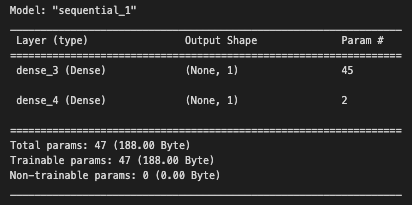
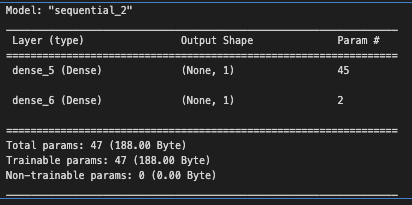

# deep-learning-challenge

## Overview 
The purpose of this analysis is to help the nonprofit foundation Alphabet Soup build a machine learning model that selects the most likely to succeed applicants for funding. We will be building a deep learning machine model that help optimize the success likelihood which can help in resource allocation for the orgnaization.

## Results
### Data Preprocessing
Using a dataset of over 34,000 records, we will preprocess the information based off of the following features: 

1) feature variables
    - APPLICATION_TYPE—Alphabet Soup application type
    - AFFILIATION—Affiliated sector of industry
    - CLASSIFICATION—Government organization classification
    - USE_CASE—Use case for funding
    - ORGANIZATION—Organization type
    - STATUS—Active status
    - INCOME_AMT—Income classification
    - SPECIAL_CONSIDERATIONS—Special considerations for application
    - ASK_AMT—Funding amount requested

2) target variable:
    - IS_SUCCESSFUL—Was the money used effectively
    - (1) = successful
    - (0) = not successful

3) removed variables:
    - variables that are not relevant to the mode:
        - EIN and NAME—Identification columns

### Compiling Training, and Evaluating the Model 
For all of the models, I determined to let the units, which are the input features, to remain the same at 44. The number is determined the from input shape of the x trained scaled data. Also the preprocessing part remained the same for all models.

#### Preoptimized Model:
- Units: 44
- Hiddenlayers: 2
    1) neurons = 1
    2) neurons = 1
- Epochs: 100
- Accuracy: 98.3%
- Loss: 0.0736

Prior to optimizing the models, i chose the ReLU function for it's simplicity in modeling positive outputs for either classification or regression data. Even if the input data is negative, the output would be 0. The output layer uses the Sigmoid function for its effective performance in binary classification tasks. 

The target model performance is 75%. This is already achieved before even experimenting with optimizing the model at a high 98.3% of accuracy. To further improve the model, I experimented with increasing/reducing neurons, hidden layers, and epochs. I also changed the activation type to tanh to determine if there was a difference in the model performances.

#### Optimized Models: 

1) Model 1: 
    - Units: 44
    - Hiddenlayers: 2
        1) neurons = 8
        2) neurons = 5
        - I increased the number of neurons for both hidden layers to increase the complexity of the deep learning model. 
    - Epochs: 50
    - Accuracy: 99.9%
    - Loss: 0.00145
    - Activation Type: ReLU

    - For the 1st optimization attempt, i decided to change the number of neurons in both hidden layers and reduce the number of epochs to 50. The results were very successful as the accuracy rate went up to 99.9%. Perhaps, the increased complexity from adding more neurons in each hidden layer helped the model learn more complex patterns, which further increase the accuracy. It also looks like the epoch reduction didn't have too much of an effect in the performance of the model. 

2) Model 2:
    - Units: 44
    - Hiddenlayers: 1
        - Neurons = 1
    - Epochs: 100
    - Accuracy: 99.9%
    - Loss:0.002
    - Activation Type: Tanh

    - The 2nd optimization attempt also yielded a very high accuracy score at 99.9%. However, it looks like the loss slight increased bt 0.0005 from the 1st optimization attempt. In this model, we reduced the number of hiddenlayers to 1 and changed the activation function to tanh. The number of neurons remained the same as the pre optimization model at 1. The number of epochs also remained the same as the pre optimization model. It appears that despite reducing the number of hidden layers, the accuracy rate still was higher than the preoptimization model. This suggests that certain activation functions can improve the performance, in this case Tanh because the input data is more classified, therefore nonlinear. 

3) Model 3:
    - Units: 44
    - Hiddenlayers: 1
        - Neurons: 1
    - Epochs: 200
    - Accuracy: 94.75%
    - Loss: 0.1766
    - Activation Type:  ReLU

    - For the 3rd optimization attempt, I wanted to confirm the difference in performance between the activation functions ReLU and Tanh. Therefore I changed the activation function back to ReLU and increase the epochs to 200. The results yielded to an accuracy of 94.75% and a loss of 0.1766. It looks like the Tanh function is indeed better suited for this specific model. Also, the increased number of epochs wasn't a benefit, but rather a drawback in the performance of the model. It looks the increasing the number of epochs here created an overfitting problem that reduced the performance of the model. 

## Summary 
* All models had very high performances (over 90%) and passed the target model performance of 75%.
* Model 2 with the Tanh function, even with only 1 hiddenlayer, performed highly at 99% and even the loss was minimal. This suggests that Tanh is better suited for this model.
* Increasing the neurons in the hiddenlayers and reduced epochs to 50 also yielded high performance at 99%. This shows that perhaps we are reducing overfitting and improving the model complexity in understanding composite patterns. 

### Recommendations 
* Deep learning models often are ideal in improving performance with datasets that are large and complex. They also can capture non-linear relationships, making them compatible for solving complex problems. However, sometimes the model can overfit the data and may require large amounts of data to perform optimally. In such cases, it would be optimal to run a model that could run a hyperparameter tuner such as the Keras Tuner. This would determine the optimal parameters such as the number of hidden layers and optimal number of neurons. Another recommendation would be considering a Random Forest model. Random Forest models can also handle large and complex datasets and used for classification and regression datasets, similar to the deep deep learning models. Random Forest models are simpler to train and use compared to deep learning models and are less time consuming. 